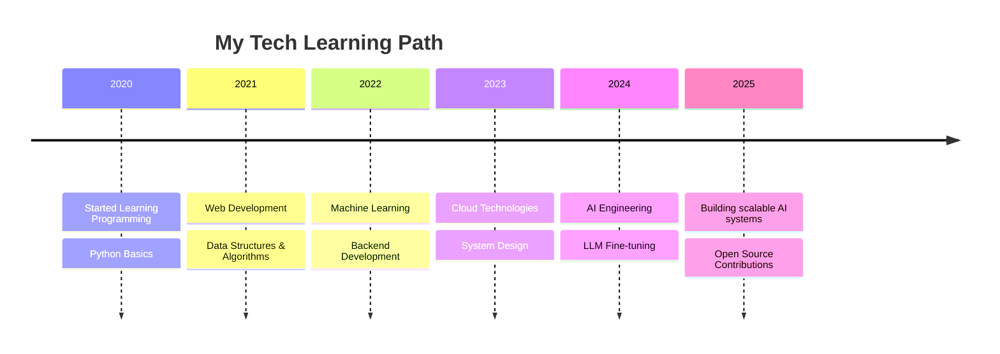

# Welcome to My Coding Universe! 🚀

<div align="center">


<br>
<samp>
  👋 Hi! I craft code and build dreams.
  <br>Check out my <a href="https://devasypatel.netlify.app">portfolio</a> for more!
</samp>

[](https://github.com/Devasy23)
[](https://github.com/Devasy23)

<div>
  <a href="#gh-light-mode-only">
    
  </a>
  <a href="#gh-dark-mode-only">
    
  </a>
</div>

</div>

## 💻 Terminal Experience

<div align="center">
  <a href="https://github.com/Devasy23/terminal-portfolio" target="_blank">
    
  </a>
  
  <p><i>👆 Click to try my interactive terminal portfolio! Type <code>help</code> to see available commands.</i></p>
  
  <p>Try these commands: <code>about</code>, <code>skills</code>, <code>projects</code>, <code>contact</code>, <code>blog</code>, <code>social</code></p>
</div>

## 👨‍💻 About Me

```typescript
const devasy = {
  location: "India",
  currentFocus: "Building scalable AI applications",
  passions: ["Software Engineering", "Machine Learning", "System Design"],
  currentlyLearning: ["LLM Fine-tuning", "Kubernetes", "Rust"],
  askMeAbout: ["Python", "AI/ML", "Backend Development", "Cloud Architecture"],
  funFact: "I debug code in my sleep!"
};
```

## ⏱️ Weekly Coding Stats

<!--START_SECTION:waka-->
<!--END_SECTION:waka-->

## 🎧 Currently Vibing To

[](https://github.com/kittinan/spotify-github-profile)

## 🚀 Skills & Stats

<div align="center">

### 🛠️ Languages & Tools
[](https://skillicons.dev)

<details>
<summary>Show more</summary>

[](https://skillicons.dev)

</details>

### 📊 GitHub Stats


### ⚡ GitHub Streak
[](https://git.io/streak-stats)

</div>

<div style="display: flex; justify-content: space-between;">

<div style="flex: 1;">

### 🏆 Trophies
[](https://github.com/ryo-ma/github-profile-trophy)

</div>

<div style="flex: 1;">

### 🏅 Achievements


</div>

</div>

## 🐍 Contribution Graph

<picture>
  <source media="(prefers-color-scheme: dark)" srcset="dist/github-snake-dark.svg" />
  
</picture>

## 📈 Activity Graph
[](https://github.com/ashutosh00710/github-readme-activity-graph)

## 🏙️ 3D Contribution Graph
<div align="center">
  <a href="https://skyline.github.com/Devasy23/2024" title="2024 GitHub Skyline">
    
  </a>
  <p><i>Click the image to view interactive 3D version</i></p>
</div>

## 📂 Featured Projects

<div align="center">

<a href="https://github.com/Devasy23/project1">
  
</a>
<a href="https://github.com/Devasy23/project2">
  
</a>

</div>

## 🎓 My Coding Journey



## 📫 Connect with Me

<div align="center">

[](https://www.linkedin.com/in/devasy-patel/)
[](https://twitter.com/Delin00249280)
[](https://leetcode.com/devasy-patel/)
[](https://devasypatel.netlify.app)

</div>

## 📝 Latest Blog Posts
<!-- BLOG-POST-LIST:START -->
<!-- This section will be automatically updated with your latest blog posts -->
<!-- BLOG-POST-LIST:END -->

---

<div align="center">
  
  <br>
  <i>Thanks for visiting my profile! Feel free to star ⭐ some repositories if you find them interesting!</i>
</div>

<!-- Secret easter egg: Find the hidden message in the README source code! -->